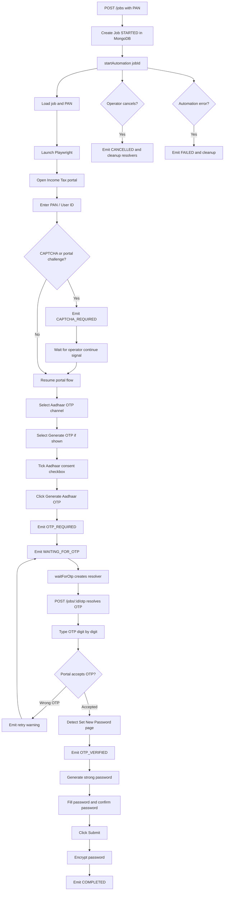
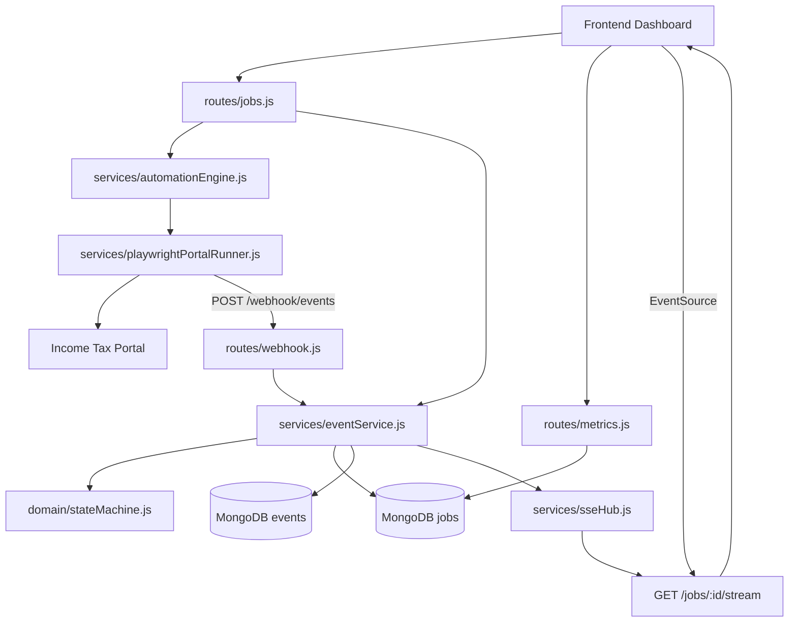
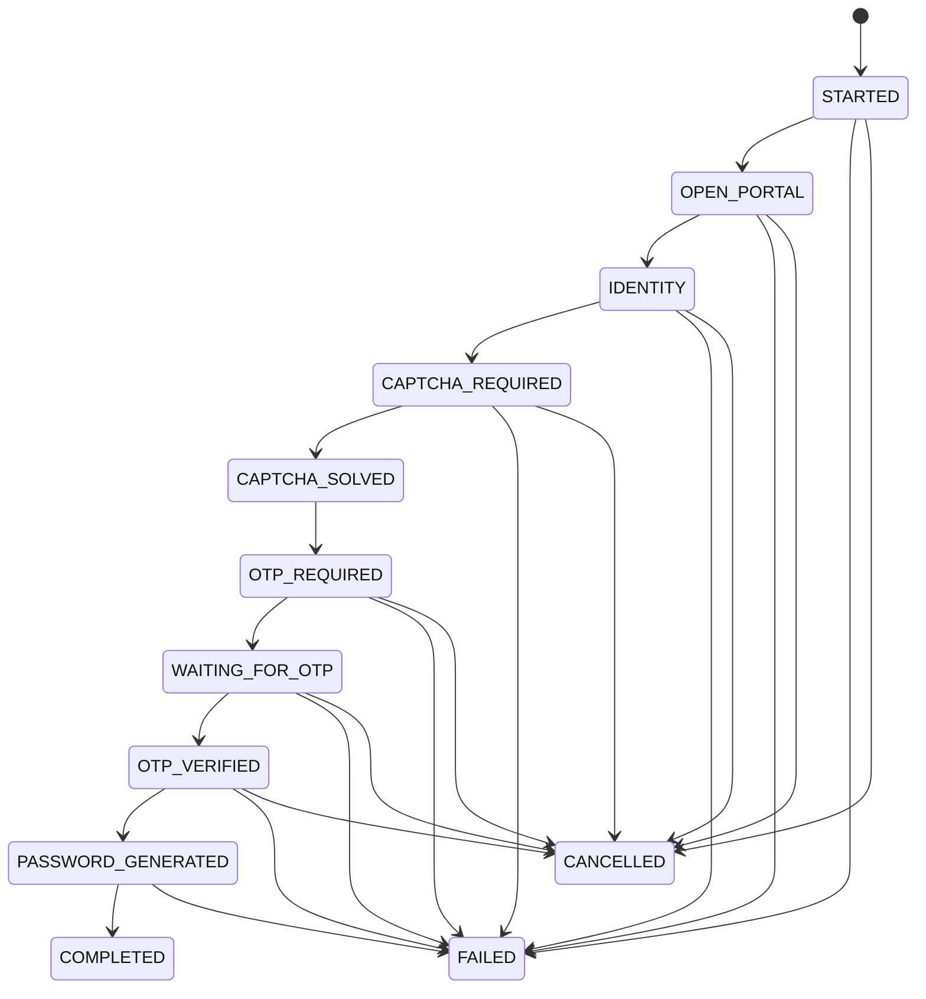
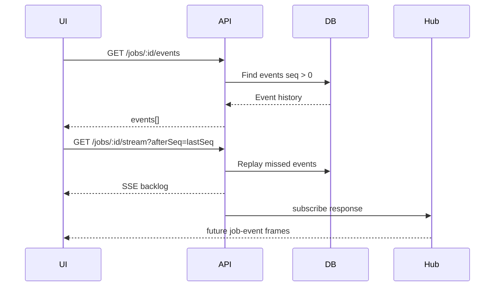

# RegisterKaro Backend Automation Service

Express + MongoDB backend for the Income Tax e-Filing password recovery automation.  
This service owns job state, event persistence, SSE streaming, metrics, and Playwright orchestration.

---

## Backend Responsibilities

- Create and track automation jobs.
- Validate every state transition through a state machine.
- Run Playwright against the live portal.
- Pause for human-in-the-loop OTP and CAPTCHA actions.
- Persist append-only event history.
- Replay missed events after SSE reconnect.
- Broadcast live events to the dashboard.
- Encrypt generated passwords before storing.
- Expose metrics for dashboard cards.
- Allow cancellation and deletion of terminal runs.

---

## Backend Flowchart



---

## Backend Architecture



---

## Folder Structure

```text
backend
├─ .env
├─ package.json
├─ src
│  ├─ config.js
│  │  Loads .env and exposes PORT, MONGO_URI, auth, webhook, portal config
│  ├─ server.js
│  │  Express server, Mongo connection, route mounting, graceful shutdown
│  ├─ domain
│  │  ├─ phases.js
│  │  │  Phase constants, terminal phases, status mapping
│  │  └─ stateMachine.js
│  │     Allowed lifecycle transitions and validation
│  ├─ middleware
│  │  ├─ auth.js
│  │  │  Bearer token guard for mutating routes
│  │  └─ requestContext.js
│  │     Request ID propagation
│  ├─ models
│  │  ├─ job.js
│  │  │  Job lifecycle, PAN hash, status, result, duration, error
│  │  └─ event.js
│  │     Append-only job event stream
│  ├─ routes
│  │  ├─ jobs.js
│  │  │  Job create/list/read/delete, SSE, OTP, cancel, continue
│  │  ├─ webhook.js
│  │  │  Automation event ingest with webhook secret
│  │  └─ metrics.js
│  │     Counts, success rate, duration percentiles
│  ├─ services
│  │  ├─ automationEngine.js
│  │  │  Starts automation, waits for OTP, queues early OTP, cancellation
│  │  ├─ playwrightPortalRunner.js
│  │  │  Browser automation and portal-specific recovery handling
│  │  ├─ eventService.js
│  │  │  State transition validation, DB writes, SSE broadcast
│  │  └─ sseHub.js
│  │     Connected SSE clients, formatting, replay buffer
│  └─ utils
│     ├─ crypto.js
│     │  Encrypt/decrypt generated credentials
│     └─ mask.js
│        PAN masking helpers
└─ test
   ├─ crypto.test.js
   ├─ domain.test.js
   └─ flow_detection.test.js
```

---

## State Machine



Status mapping:

```text
COMPLETED       -> completed
FAILED          -> failed
CANCELLED       -> cancelled
WAITING_FOR_OTP -> waiting_for_operator
other phases    -> running
```

---

## Portal Automation Features

`src/services/playwrightPortalRunner.js` handles portal variations found during debugging:

- PAN/User ID input selector fallbacks.
- Recovery form detection.
- CAPTCHA boundary and manual continue.
- Aadhaar mobile OTP channel selection.
- Generate OTP vs already-have-OTP radio choice.
- Aadhaar consent checkbox page.
- Generate Aadhaar OTP button.
- Split OTP boxes with digit-by-digit typing.
- Angular `input`, `change`, `keyup`, blur, and Tab validation triggers.
- Auto-detection when OTP moves directly to `Set New Password`.
- Password and confirm-password fill with validation events.
- Final password submit and completion event.

---

## API Routes

### Jobs

| Method | Path | Auth | Purpose |
| --- | --- | --- | --- |
| `POST` | `/jobs` | Bearer | Create and start a run |
| `GET` | `/jobs` | No | List runs with filters |
| `GET` | `/jobs/:id` | No | Fetch one run |
| `DELETE` | `/jobs/:id` | Bearer | Delete terminal run and events |
| `GET` | `/jobs/:id/events` | No | Replay event history |
| `GET` | `/jobs/:id/stream` | No | SSE stream with replay cursor |
| `POST` | `/jobs/:id/continue` | Bearer | Continue after manual CAPTCHA |
| `POST` | `/jobs/:id/otp` | Bearer | Submit OTP to paused automation |
| `POST` | `/jobs/:id/cancel` | Bearer | Cancel active automation |

### Webhook

| Method | Path | Auth | Purpose |
| --- | --- | --- | --- |
| `POST` | `/webhook/events` | `X-Webhook-Secret` | Append automation event |

### Metrics

| Method | Path | Auth | Purpose |
| --- | --- | --- | --- |
| `GET` | `/metrics` | No | Dashboard metrics |

---

## SSE Replay



SSE headers:

```http
Content-Type: text/event-stream
Cache-Control: no-cache, no-transform
Connection: keep-alive
X-Accel-Buffering: no
```

The route also calls `flushHeaders()` and sends heartbeats.

---

## Data Model Summary

### Job

```text
jobId
pan                 select:false
maskedPan
panMasked
panHash
phase
status
lastSeq
startedAt
updatedAt
completedAt
durationMs
outcome
result.userId
result.encryptedPassword
error
requestId
```

### Event

```text
eventId = jobId:seq
jobId
seq
phase
level
message
step
timestamp
requestId
metadata
error
```

---

## Environment

`backend/.env`

```bash
PORT=4000
SERVICE_BASE_URL=http://localhost:4000
MONGO_URI=mongodb://127.0.0.1:27017/registerkaro_itr
AUTH_TOKEN=change-me
WEBHOOK_SECRET=change-me-too
PORTAL_URL=https://www.incometax.gov.in/iec/foportal/
PLAYWRIGHT_HEADLESS=false
```

---

## Run Locally

Install:

```bash
npm install
```

Start backend:

```bash
npm run dev
```

Health check:

```bash
curl http://localhost:4000/health
```

---

## Test

```bash
npm test
```

Syntax checks:

```bash
node --check src/server.js
node --check src/routes/jobs.js
node --check src/routes/metrics.js
node --check src/services/playwrightPortalRunner.js
node --check src/services/automationEngine.js
```

Current test coverage includes:

- crypto encrypt/decrypt
- state machine allowed/rejected transitions
- status mapping
- PAN masking
- SSE formatting
- OTP resolver behavior
- portal flow text detection

---

## Operational Notes

- Keep `PLAYWRIGHT_HEADLESS=false` while debugging CAPTCHA or portal UI.
- OTP is intentionally not auto-read from SMS/email; operator supplies it from dashboard.
- If OTP arrives before the resolver is ready, backend queues it and `waitForOtp()` consumes it.
- Cancel emits `CANCELLED` immediately and cleans in-memory resolvers.
- Delete is allowed only for terminal jobs: `completed`, `failed`, `cancelled`.
